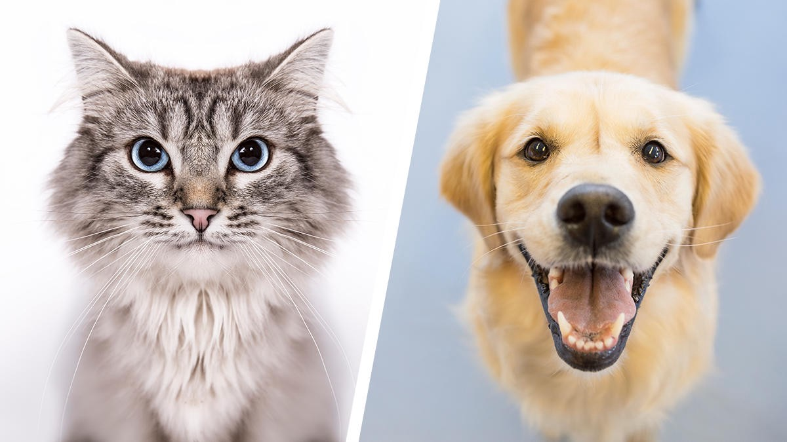
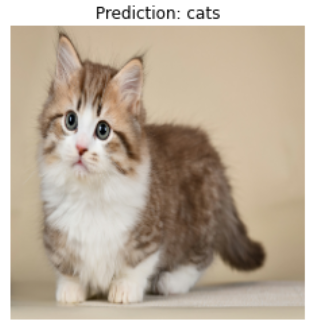
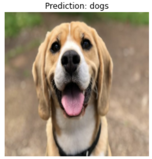

# Cat Dog Identificator using CNN

On this project, i want to share how computer can process image input (Computer Vision), in this case model will predict which cat or dog based on picture using Convlution Neural Network (Deep Learning).

 
For full report of this project, please visit <a href=https://github.com/Juantonios1/Cat-Dog-Identificator-using-CNN/blob/main/Cat%20%26%20Dog%20Identificator%20.Ipynb/Cat%20%26%20Dog%20Identificator%20Using%20Computer%20Vision%20with%20CNN.ipynb>
Cat & Dog Recognizer Using CNN</a>.

## Summary Process
<!-- TABLE OF CONTENTS -->

  
Table of Content

  <ol>
    <li><a href="#problem-statement">Problem Statement</a></li>
    <li><a href="#data-understanding">Data Understanding</a></li>
    <li><a href="#data-preprocessing">Data Preprocessing</a></li>
    <li><a href="#modeling">Modeling</a></li>
    <li><a href="#prediction">Prediction</a></li>
    <li><a href="#conclusion">Conclusion and Recommendation</a></li>
    <li><a href="#contributors">Contributors</a></li>
  </ol>

## Problem Statement
**Background :**  
As computer vision technology advances and mobile camera devices become more widespread, this trend has resulted in an increase in the number of computer vision apps for object detection. Animal detection and recognition are becoming increasingly important in a variety of industries, including animal husbandry, pet care & lost and found, as well as wildlife conservation. It can be happen because of the advancement of computer vision and the availability of affordable photographic equipment enables the automatic recognition of objects.  
Source: https://hal.archives-ouvertes.fr/hal-03501010/document

**Problem :**  
Clasify image of dog or cat is easy for humans, but evidence suggests that cats and dogs are particularly difficult to tell apart automatically. Computer cannot see the image directly but need to convert it into number. The simple method using machine learning didnt give statisfaction result. So we need other algortihm to solve that problem.

**Goals :**  
Model can differentiate picture between cats and dogs.

**Metrix Evaluation**
Accuracy: Error in each class is important.

## Data Understanding

All dataset based on <a href=https://www.kaggle.com/datasets/chetankv/dogs-cats-images> MNIST Number Dataset</a>. Sample Data:

* Data Train: Contain 4000 images of cats and 4000 images of dogs.
* Data Test: Contain 1000 images of cats and 1000 images of dogs.

## Data Preprocessing
At this stage, data preparation and processing will be carried out before being used as a data model, as follows:
* Normalization.
* Batching.

## Modeling
At this stage will be done making and optimizing the deep learning model, as follows:
* Baseline.
* Adjust parameter on model.
  * Learning Rate.
  * Data Augmentation.
  * Increase Hidden Unit.
  * Increase Hidden Layers.
  * Increase Epochs.

## Prediction
At this stage there will be try model to predict several sample:
* Prediction test 1:

* Prediction test 2:

## Conclusion 
We conclude our result and give recommendation based on it

* Model Performance

   

* Summary Model  

   

* Evaluation Metrix

   

* Conclusion
  * Overall Convolution Neural Network can be used to differentiate image of cats and dogs.
 

For full report of this project, please visit <a href=https://github.com/Juantonios1/Cat-Dog-Identificator-using-CNN/blob/main/Cat%20%26%20Dog%20Identificator%20.Ipynb/Cat%20%26%20Dog%20Identificator%20Using%20Computer%20Vision%20with%20CNN.ipynb>
Cat & Dog Recognizer Using CNN</a>.

## Contributors:
Juan Antonio Suwardi - antonio.juan.suwardi@gmail.com  
